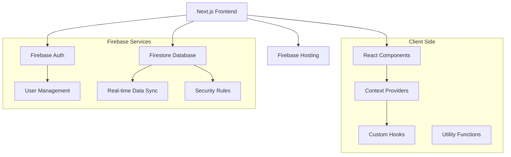
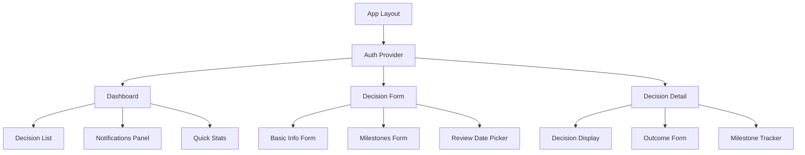

# Design Document

## Overview

Decideful is a Next.js web application that provides a comprehensive decision journaling experience. The application uses Firebase for authentication and Firestore for data persistence, ensuring secure user data management and real-time synchronization across devices. The design follows a mobile-first approach with responsive layouts that work seamlessly on desktop and mobile devices.

## Architecture

### High-Level Architecture



### Technology Stack

- **Frontend Framework**: Next.js 14 with App Router
- **Language**: TypeScript for type safety
- **Styling**: Tailwind CSS for responsive design
- **Authentication**: Firebase Auth
- **Database**: Firebase Firestore
- **State Management**: React Context + useReducer
- **Form Handling**: React Hook Form with Zod validation
- **Date Handling**: date-fns library
- **Deployment**: Vercel (optimal for Next.js)

## Components and Interfaces

### Core Data Models

```typescript
interface User {
  uid: string;
  email: string;
  displayName?: string;
  createdAt: Date;
}

interface Decision {
  id: string;
  userId: string;
  title: string;
  context: string;
  finalChoice: string;
  expectedOutcome: string;
  reviewDate: Date;
  status: 'pending' | 'reviewed';
  milestones: Milestone[];
  actualOutcome?: string;
  expectationCorrect?: boolean;
  keyLearnings?: string;
  createdAt: Date;
  updatedAt: Date;
}

interface Milestone {
  id: string;
  description: string;
  expectedDate: Date;
  category: 'skill' | 'money' | 'network' | 'familiarity' | 'other';
  achieved?: boolean;
  notes?: string;
}

interface Notification {
  id: string;
  userId: string;
  decisionId: string;
  type: 'milestone' | 'review';
  message: string;
  isRead: boolean;
  createdAt: Date;
}
```

### Component Architecture



### Key Components

1. **AuthProvider**: Manages authentication state and user context
2. **Dashboard**: Main screen displaying decisions and notifications
3. **DecisionForm**: Create/edit decision with milestones
4. **DecisionDetail**: View decision details and log outcomes
5. **MilestoneTracker**: Component for managing milestone states
6. **NotificationPanel**: Display and manage reminders
7. **ProtectedRoute**: HOC for authentication-required pages

## Data Models

### Firestore Collections Structure

```
users/{userId}
├── profile: UserProfile
└── decisions/{decisionId}
    ├── decision: Decision
    └── milestones: Milestone[]

notifications/{notificationId}
├── notification: Notification
```

### Security Rules

```javascript
// Firestore Security Rules
rules_version = '2';
service cloud.firestore {
  match /databases/{database}/documents {
    // Users can only access their own data
    match /users/{userId} {
      allow read, write: if request.auth != null && request.auth.uid == userId;

      match /decisions/{decisionId} {
        allow read, write: if request.auth != null && request.auth.uid == userId;
      }
    }

    // Notifications are user-specific
    match /notifications/{notificationId} {
      allow read, write: if request.auth != null &&
        request.auth.uid == resource.data.userId;
    }
  }
}
```

## Error Handling

### Error Boundaries

- **Global Error Boundary**: Catches unhandled React errors
- **Route Error Boundaries**: Handles page-level errors
- **Form Error Handling**: Validation and submission errors

### Error Types and Handling

1. **Authentication Errors**
   - Invalid credentials → Display user-friendly message
   - Network errors → Retry mechanism with exponential backoff
   - Session expiry → Automatic redirect to login

2. **Database Errors**
   - Connection issues → Offline mode with local caching
   - Permission errors → Clear error messages
   - Validation errors → Field-specific error display

3. **Form Validation Errors**
   - Real-time validation using Zod schemas
   - Field-level error messages
   - Form submission prevention until valid

### Offline Support

- **Service Worker**: Cache static assets and API responses
- **Local Storage**: Temporary storage for offline form data
- **Sync Strategy**: Queue operations when offline, sync when online

## Testing Strategy

### Testing Pyramid

1. **Unit Tests (70%)**
   - Component testing with React Testing Library
   - Utility function testing
   - Custom hook testing
   - Form validation testing

2. **Integration Tests (20%)**
   - Firebase integration testing
   - Authentication flow testing
   - Data persistence testing
   - Cross-component interaction testing

3. **End-to-End Tests (10%)**
   - Critical user journeys with Playwright
   - Authentication flows
   - Decision creation and review workflows
   - Mobile responsiveness testing

### Test Coverage Goals

- **Components**: 90% coverage
- **Utilities**: 95% coverage
- **Hooks**: 85% coverage
- **Integration**: Key user flows covered

### Testing Tools

- **Unit/Integration**: Jest + React Testing Library
- **E2E**: Playwright
- **Firebase Testing**: Firebase Emulator Suite
- **Visual Regression**: Chromatic (if needed)

## Performance Considerations

### Optimization Strategies

1. **Code Splitting**
   - Route-based code splitting with Next.js
   - Component lazy loading for heavy components
   - Dynamic imports for Firebase SDK

2. **Data Fetching**
   - Server-side rendering for initial page load
   - Client-side caching with SWR or React Query
   - Firestore query optimization with proper indexing

3. **Bundle Optimization**
   - Tree shaking for unused code
   - Image optimization with Next.js Image component
   - Font optimization with next/font

4. **Caching Strategy**
   - Static asset caching
   - API response caching
   - Firestore offline persistence

## Security Considerations

### Authentication Security

- Firebase Auth handles secure token management
- Automatic token refresh
- Secure session management

### Data Security

- Firestore security rules enforce user data isolation
- Input sanitization and validation
- XSS protection through React's built-in escaping

### Privacy

- No sensitive data in client-side code
- Proper error handling to avoid data leaks
- GDPR compliance considerations for user data

## Deployment and Infrastructure

### Deployment Pipeline

1. **Development**: Local development with Firebase emulators
2. **Staging**: Vercel preview deployments for testing
3. **Production**: Vercel production deployment with custom domain

### Environment Configuration

- **Development**: Local Firebase emulators
- **Staging**: Firebase staging project
- **Production**: Firebase production project

### Monitoring and Analytics

- **Error Tracking**: Sentry for error monitoring
- **Performance**: Vercel Analytics for performance metrics
- **User Analytics**: Firebase Analytics for user behavior (optional)

## Mobile Responsiveness

### Breakpoint Strategy

- **Mobile**: 320px - 768px (primary focus)
- **Tablet**: 768px - 1024px
- **Desktop**: 1024px+

### Mobile-First Design Principles

- Touch-friendly interface elements (44px minimum touch targets)
- Optimized form layouts for mobile keyboards
- Swipe gestures for navigation where appropriate
- Progressive enhancement for larger screens
